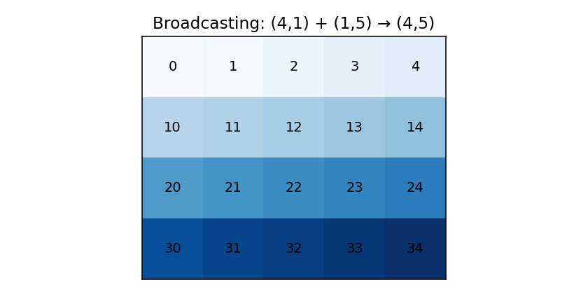

# Broadcasting deeply

Broadcasting is the single rule that makes NumPy worth learning. It is how you write `a + b` for arrays of different shapes and get the answer you wanted, with no explicit looping and no allocation of an intermediate "padded" array.

## The rule, stated precisely

When NumPy operates element-wise on two arrays of shapes `s1` and `s2`:

1. **Right-align the shapes** by padding the shorter one with leading 1s.
2. **Compare each axis pair** from the right. Two axes are compatible iff:
   - they are equal, **or**
   - one of them is 1.
3. The result shape is the element-wise **maximum** across each pair of compatible axes.
4. The operation is performed as if the axis-1 dimensions were stretched to the matching size — but no memory is copied. NumPy iterates with stride 0 over the broadcast axes.

That's the whole rule. Everything else is consequences.

## A picture

```
A:  (    4, 1)
B:  (1,     5)
-------------
out: (   4, 5)
```

```python
import numpy as np

A = np.array([[1], [2], [3], [4]])      # shape (4, 1)
B = np.array([[10, 20, 30, 40, 50]])    # shape (1, 5)
print(A + B)
# [[11 21 31 41 51]
#  [12 22 32 42 52]
#  [13 23 33 43 53]
#  [14 24 34 44 54]]
```



NumPy iterates over the (4, 5) output and looks up `A[i, 0]` and `B[0, j]`. The stride of `A` along axis 1 is 0, and the stride of `B` along axis 0 is 0 — which is the literal machinery of broadcasting. No memory blew up to (4, 5); the loop just *behaves* as if.

## Three patterns you'll use weekly

### 1. Subtract a per-row mean

```python
X = np.random.randn(1000, 5)
mu = X.mean(axis=1, keepdims=True)     # shape (1000, 1) — note keepdims
centered = X - mu                       # broadcasts: (1000, 5) - (1000, 1) → (1000, 5)
```

`keepdims=True` is the trick. Without it, `mean(axis=1)` would return shape `(1000,)`, which would broadcast as `(1, 1000)` (right-aligned) and produce the wrong answer.

### 2. Compute a pairwise distance matrix

```python
X = np.random.randn(100, 3)              # 100 points in 3D
diff = X[:, None, :] - X[None, :, :]     # shape (100, 100, 3)
dist = np.linalg.norm(diff, axis=2)      # shape (100, 100)
```

`X[:, None, :]` inserts a new axis (size 1) in position 1. `X[None, :, :]` does it in position 0. They broadcast against each other to (100, 100, 3), and the norm collapses the last axis. The whole thing is a one-liner that allocates one O(N²) array and runs at C speed.

### 3. Outer product without `np.outer`

```python
a = np.array([1, 2, 3])
b = np.array([10, 20, 30, 40])
print(a[:, None] * b[None, :])
# [[ 10  20  30  40]
#  [ 20  40  60  80]
#  [ 30  60  90 120]]
```

`a[:, None]` is `(3, 1)`; `b[None, :]` is `(1, 4)`; product broadcasts to `(3, 4)`. This is exactly `np.outer(a, b)`, but the pattern generalises: replace `*` with any element-wise op and you get an "outer op".

## `np.newaxis` and `None` — interchangeable

`np.newaxis` is literally `None`. Both insert a new axis. Use whichever reads better:

```python
a = np.arange(5)
a[:, np.newaxis].shape, a[:, None].shape   # ((5, 1), (5, 1))
```

The course tends to use `None` because it's shorter.

## `axis` keyword — the half of NumPy you actually use

Almost every reducing function (`sum`, `mean`, `std`, `argmax`, `cumsum`, ...) takes an `axis` argument. Read it as **"the axis to collapse"**.

- `np.sum(x, axis=0)` → sum down each column. Result shape drops axis 0.
- `np.sum(x, axis=1)` → sum across each row. Result drops axis 1.
- `np.sum(x, axis=(0, 2))` → sum down axes 0 and 2 simultaneously.
- `np.sum(x)` → scalar.

When you want to keep the reduced axis as size-1 (for broadcasting back), add `keepdims=True`.

## `np.einsum` for explicit axis bookkeeping

Broadcasting is great, but it can be hard to read when the shapes are big. `np.einsum` lets you spell out the axis structure exactly. We give it a dedicated chapter (#4) — for now, the teaser:

```python
# pairwise distance matrix via einsum
X = np.random.randn(100, 3)
# (i, k) and (j, k) → (i, j, k)
sqd = np.einsum("ik,jk->ij", X, X) * 0    # placeholder; real version below
```

We'll write this out properly in the einsum chapter.

## Pitfalls

!!! warning "1D arrays vs row vectors"
    `a = np.array([1, 2, 3])` has shape `(3,)`. It is *neither* a row vector nor a column vector. When you do `a.T`, the result is still `(3,)`. To get a column vector, `a[:, None]`. To get a row vector, `a[None, :]`.

!!! warning "Broadcasting hides shape bugs"
    `np.add(a, b)` will happily compute `(1000, 5) + (5,)` because it broadcasts the second to `(1, 5)`. If you intended `(1000, 5) + (1000,)` (a per-row scalar), the silent answer is wrong. `keepdims=True` and being explicit about axes is the fix.

!!! warning "Boolean masks promote"
    `np.array([True, False, True]) + 1` gives `array([2, 1, 2])` — booleans promote to int. Usually fine; occasionally surprising.

## A real-world example: vectorising a momentum signal

You have a price matrix `P` of shape `(T, N)` (T timestamps, N symbols) and you want a cross-sectional momentum signal: at each `t`, rank the past-60-day return per symbol from -0.5 to +0.5.

The non-vectorised pseudo-code is:

```
for t in range(60, T):
    rets = P[t] / P[t - 60] - 1
    ranks = scipy.stats.rankdata(rets) / N - 0.5 - 1/(2N)
    signal[t] = ranks
```

The vectorised version:

```python
import numpy as np

returns = P[60:] / P[:-60] - 1                          # shape (T-60, N)
# rank within each row, normalised to centered [-0.5, +0.5]
order = returns.argsort(axis=1).argsort(axis=1)         # rank (0..N-1) per row
signal = order / (returns.shape[1] - 1) - 0.5
```

Three lines. The whole thing is broadcasting and `axis=1` reductions. Try the loop version on T=10,000, N=2,000 and you'll be waiting minutes. The vectorised version is sub-second.

Continue to **[Vectorisation patterns](03-vectorization.md)**.
