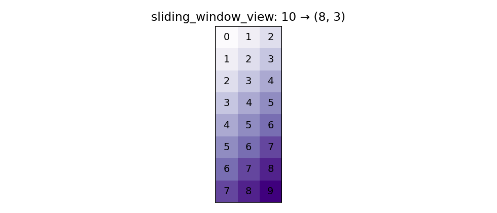

# Strided rolling windows

For time series work, you'll want to apply an operation to every rolling window of length `W` over a 1D array. Pandas has `.rolling()` for this, and it's the right tool 80% of the time. The remaining 20% — really tight inner loops, custom window functions, or when you need raw 2D-window arrays for a model — is where NumPy's stride tricks come in.

## The modern API: `sliding_window_view`

Since NumPy 1.20, the safe way to build rolling-window views is `np.lib.stride_tricks.sliding_window_view`:

```python
import numpy as np
from numpy.lib.stride_tricks import sliding_window_view

a = np.arange(10)
w = sliding_window_view(a, window_shape=3)
print(w.shape)   # (8, 3)
print(w)
# [[0 1 2]
#  [1 2 3]
#  [2 3 4]
#  ...
#  [7 8 9]]
```

The result is a **view** — no data is copied. Each row is one window. From here, you can apply any reduction along axis 1:

```python
moving_mean = w.mean(axis=1)
moving_max  = w.max(axis=1)
moving_std  = w.std(axis=1)
```

For a million-element array with window 60, this is faster than `pd.Series.rolling` and uses no extra memory.



### A worked example: rolling realized vol

```python
def realized_vol(log_returns: np.ndarray, window: int = 20) -> np.ndarray:
    w = sliding_window_view(log_returns, window_shape=window)
    return np.sqrt(np.einsum("ij,ij->i", w, w) / window)
```

`einsum` for the row-wise sum of squares; sqrt; done. Indistinguishable from C in speed.

!!! warning "The first `window-1` elements are missing"
    `sliding_window_view(a, W)` returns shape `(len(a) - W + 1, W)`. To align with the original array's index, pad the front with `np.nan`:
    ```python
    out = np.full(len(log_returns), np.nan)
    out[window - 1:] = np.sqrt(np.einsum("ij,ij->i", w, w) / window)
    ```

### Multidimensional windows

`sliding_window_view` works in N dimensions:

```python
img = np.arange(36).reshape(6, 6)
patches = sliding_window_view(img, window_shape=(3, 3))
print(patches.shape)   # (4, 4, 3, 3)
```

`patches[i, j]` is a 3×3 patch starting at `(i, j)`. The same trick that powers convolutions in deep learning, by the way.

## The lower-level: `as_strided`

`sliding_window_view` is implemented on top of `np.lib.stride_tricks.as_strided`, which lets you build *any* view by directly specifying shape and strides. It's the most dangerous function in NumPy because it has no bounds checking — get the strides wrong and you read random memory.

```python
from numpy.lib.stride_tricks import as_strided

a = np.arange(10, dtype=np.int64)
# Manually build a (8, 3) window view of a 1D array
W = 3
out_shape = (len(a) - W + 1, W)
out_strides = (a.strides[0], a.strides[0])   # both axes step 8 bytes
windows = as_strided(a, shape=out_shape, strides=out_strides, writeable=False)
```

Yes, `sliding_window_view` does exactly the above for you with bounds checking and the `writeable=False` enforced. **Use `sliding_window_view`. Reach for `as_strided` only when you need a non-window stride pattern that the higher-level API doesn't expose.**

!!! danger "as_strided footguns"
    - Pass `writeable=False` unless you really mean to allow writes. Allowing writes through a strided view is a great way to corrupt data because the same memory is in many windows.
    - The result shares memory with the input. Holding it past the input's lifetime is undefined.
    - The result is contiguous in a "view" sense, not a memory sense. Many other NumPy ops will copy it the moment you use it.

## When to prefer pandas

| Need | Tool |
|---|---|
| Time-aware rolling (e.g. last 30 days, irregular timestamps) | `pd.Series.rolling("30D")` |
| Min-periods / how to handle NaN | `pd.Series.rolling(W, min_periods=...)` |
| Exponential moving average | `pd.Series.ewm(span=...)` |
| Custom window function with state | `pd.Series.rolling(W).apply(fn, raw=True, engine="numba")` |
| Fixed-window numerical reductions on a contiguous numpy array | `sliding_window_view` |

The line is: if it involves a DataFrame index, pandas. If it's a clean numerical operation on a NumPy array, `sliding_window_view`.

## Speed comparison

```python
import numpy as np
import pandas as pd
from numpy.lib.stride_tricks import sliding_window_view

a = np.random.randn(1_000_000)
W = 60

# pandas
%timeit pd.Series(a).rolling(W).std().values
# 35 ms

# numpy sliding window
%timeit sliding_window_view(a, W).std(axis=1)
# 10 ms

# einsum version of mean
mean = sliding_window_view(a, W).mean(axis=1)
%timeit sliding_window_view(a, W).mean(axis=1)
# 2 ms
```

The NumPy versions are 3–17× faster. For a one-off computation in a notebook, it doesn't matter. For a hot path in a backtester sweeping thousands of parameter combinations, it matters a lot.

## A custom rolling reduction with `np.apply_along_axis`

If the window operation isn't a built-in reduction, you can still vectorise it:

```python
from numpy.lib.stride_tricks import sliding_window_view

def rolling_skew(x: np.ndarray, W: int) -> np.ndarray:
    w = sliding_window_view(x, W)
    m = w.mean(axis=1, keepdims=True)
    centered = w - m
    s = centered.std(axis=1, keepdims=True)
    return ((centered / s) ** 3).mean(axis=1)
```

We didn't need a Python loop because skew is just three reductions stacked. For genuinely custom per-window code, **numba** is the right tool:

```python
import numba

@numba.njit(parallel=True, fastmath=True)
def rolling_custom(x, W):
    n = len(x)
    out = np.empty(n - W + 1)
    for i in numba.prange(n - W + 1):
        w = x[i : i + W]
        # any custom logic over w
        out[i] = ...
    return out
```

`parallel=True` and `prange` parallelise across windows on multiple cores. For 100M-element arrays this matters.

## Don't forget downsampling

A rolling op that you only sample every Kth window: just stride into the result.

```python
hourly_mean = sliding_window_view(minute_prices, 60).mean(axis=1)[::60]
```

Faster than pandas resampling for the case of regularly-spaced data, because no datetime arithmetic happens.

Continue to **[Numerical stability](06-stability.md)**.
